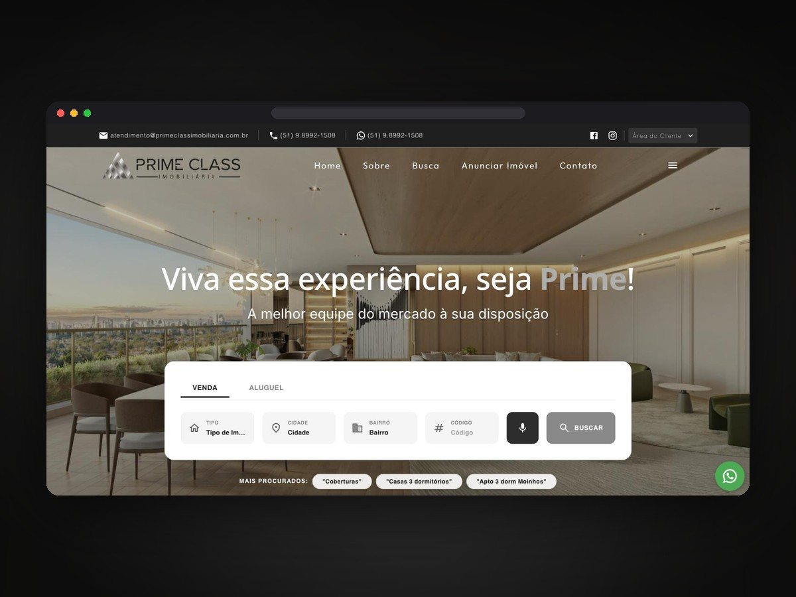
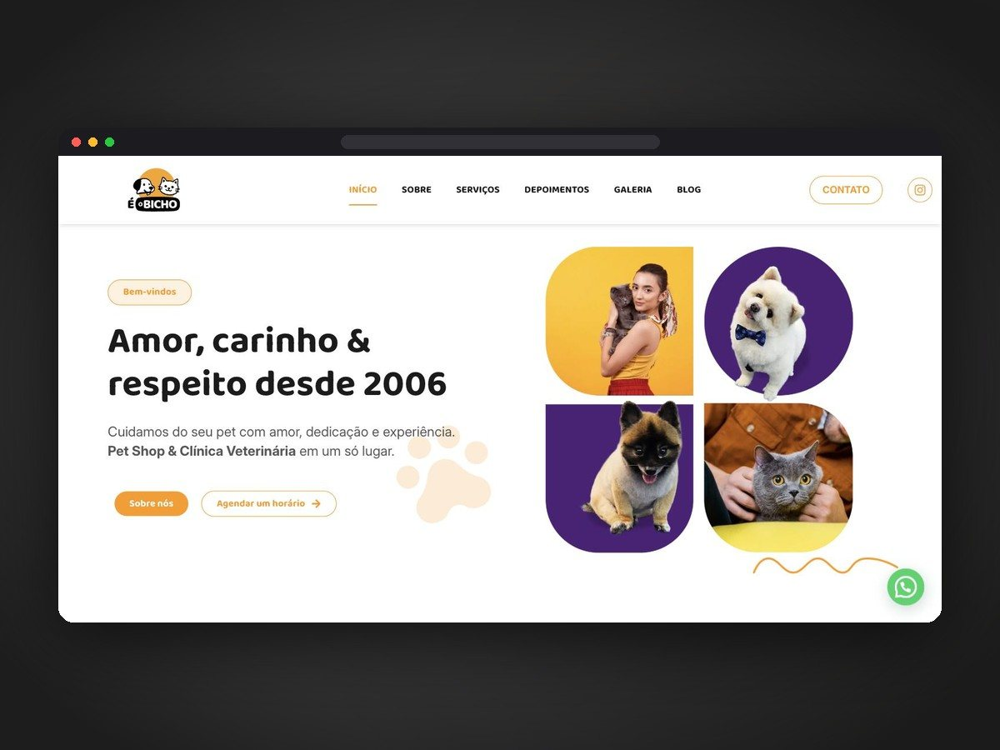
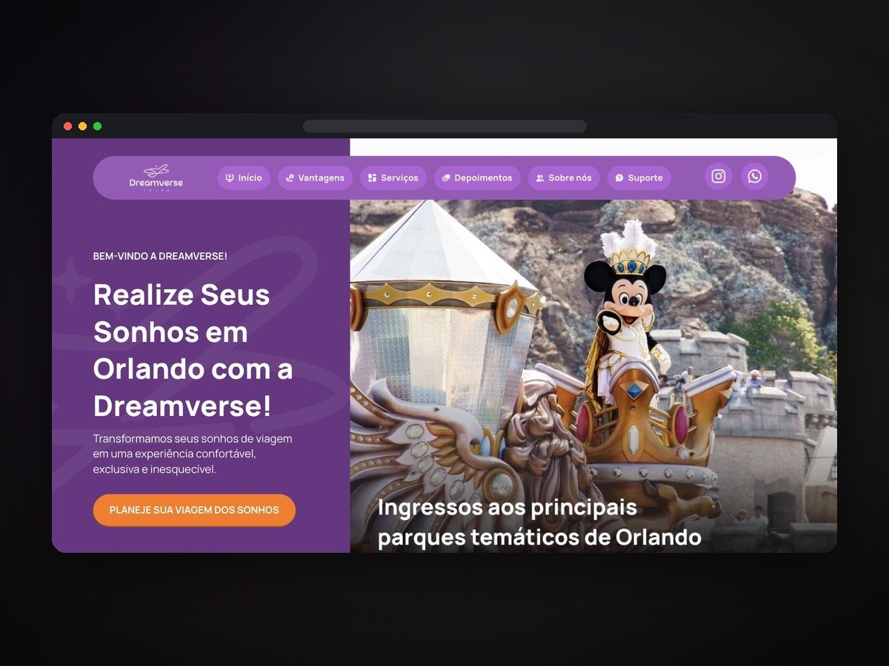

# Pedro Henrique

Webdesigner e desenvolvedor web, trabalhando de forma remota. Sou gestor de projetos na V4 Torque&Co., unidade da V4 Company, e crio sites institucionais, landing pages e sistemas sob medida para empresas.

*Web designer and developer working remotely. I build business websites, landing pages and custom management systems.*

### Destaque: Zayr, sistema de gestão

**Meu maior projeto.** Um sistema de gestão que reúne a empresa inteira em um só painel. Projetei e desenvolvi do zero, do design ao back-end.

- **Vendas e metas:** painel da loja com meta, vendido e quanto falta
- **CRM da equipe e funil de leads:** do primeiro contato ao fechamento
- **Marketing:** calendário de conteúdo e acompanhamento de leads
- **Agenda, estoque e pós-venda** no mesmo lugar

Nasceu para lojas de veículos e se adapta a qualquer operação com clientes, estoque e agenda. Site: [zayr.com.br](https://zayr.com.br) · Telas: [vitrine do Zayr](https://github.com/DarkAvocard/zayr-vitrine) (o código é privado).

### Sites

| | |
|---|---|
|  **Prime Class Imobiliária** · site institucional |  **É o Bicho** · pet shop e clínica |
|  **Dreamverse** · agência de viagens |  **Autoescola Carajás** · landing page |
|  **Marta Miudezas** · site institucional | |

Mais trabalhos no [portfólio](https://portfolio-pdr.netlify.app).

### O que eu faço

- Sites institucionais e landing pages
- Sistemas, painéis e CRMs sob medida
- Artes e posts alinhados à identidade de cada marca

### Ferramentas

HTML · CSS · JavaScript · TypeScript · Railway · Netlify

### Contato

- Portfólio: [portfolio-pdr.netlify.app](https://portfolio-pdr.netlify.app)
- LinkedIn: [Pedro Henrique](https://www.linkedin.com/in/pedro-henrique-3a842b43b)
- WhatsApp: [(94) 99101-3558](https://wa.me/5594991013558)
