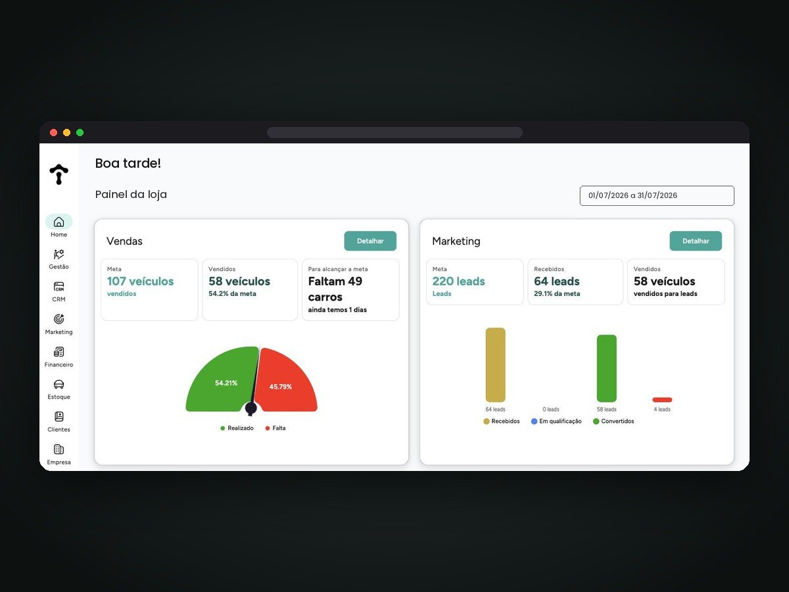
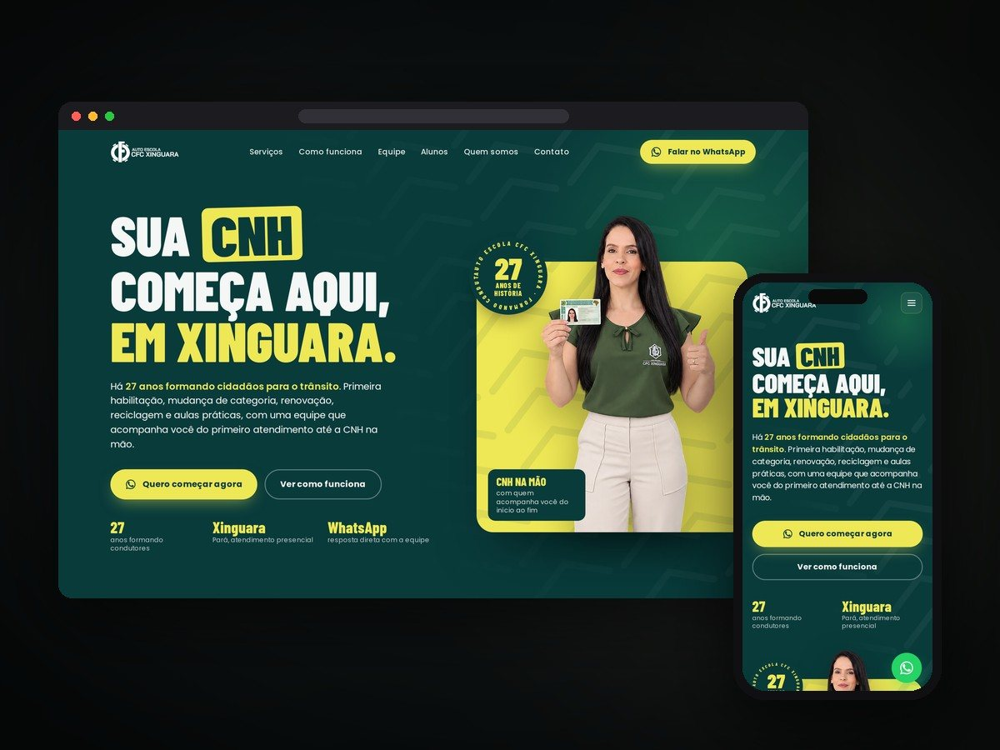
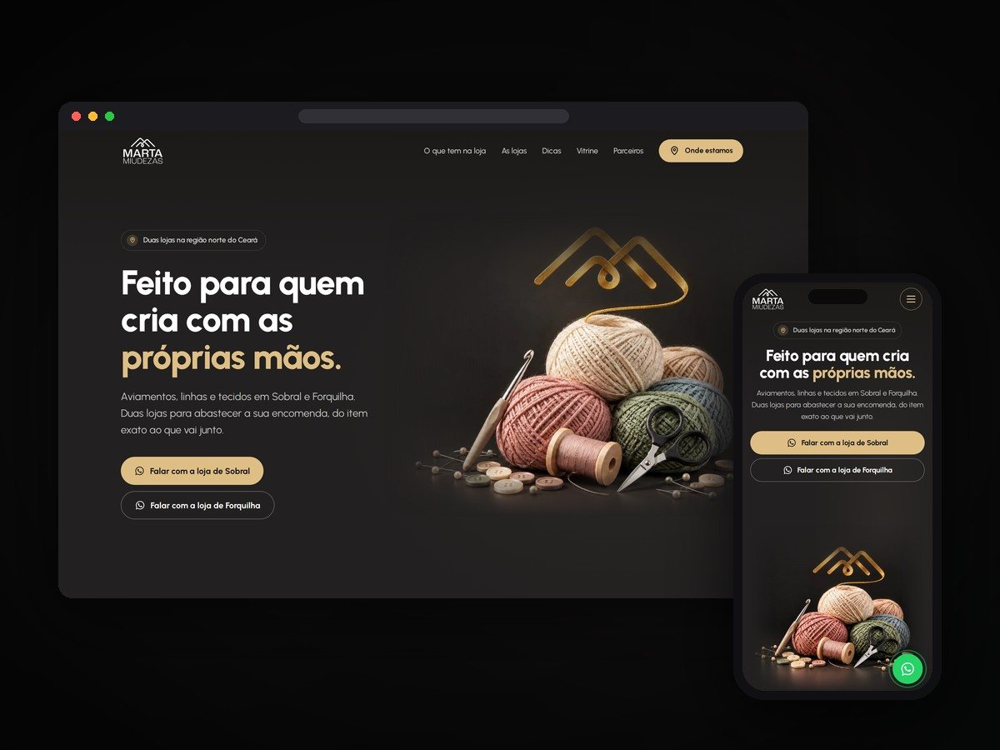

# Pedro Henrique

Webdesigner e desenvolvedor web, trabalhando de forma remota. Sou gestor de projetos na V4 Torque&Co., unidade da V4 Company, e crio sites institucionais, landing pages e sistemas sob medida para empresas.

*Web designer and developer working remotely. I build business websites, landing pages and custom management systems.*

### Projetos

| | |
|---|---|
|  **Autoescola Carajás** · landing page |  **Zayr** · sistema de gestão |
|  **CFC Xinguara** · landing page |  **Marta Miudezas** · site institucional |
|  **CFC Dirigir** · landing page | Mais trabalhos no [portfólio](https://portfolio-pdr.netlify.app) |

O código dos sistemas é privado. Aqui ficam só as telas e a descrição.

### Zayr

Meu principal projeto. Sistema de gestão que nasceu para lojas de veículos (vendas e metas, leads, CRM da equipe, agenda e pós-venda) e se adapta a qualquer operação com estoque, clientes e agenda. As telas estão na [vitrine do Zayr](https://github.com/DarkAvocard/zayr-vitrine).

### O que eu faço

- Sites institucionais e landing pages
- Sistemas, painéis e CRMs sob medida
- Artes e posts alinhados à identidade de cada marca

### Ferramentas

HTML · CSS · JavaScript · TypeScript · Railway · Netlify

### Contato

- Portfólio: [portfolio-pdr.netlify.app](https://portfolio-pdr.netlify.app)
- LinkedIn: [Pedro Henrique](https://www.linkedin.com/in/pedro-henrique-3a842b43b)
- WhatsApp: [(94) 99101-3558](https://wa.me/5594991013558)
